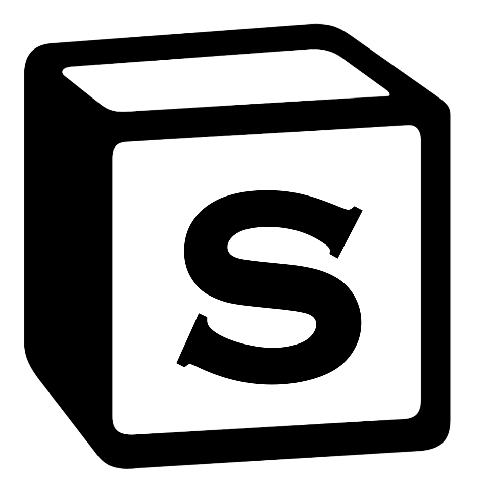
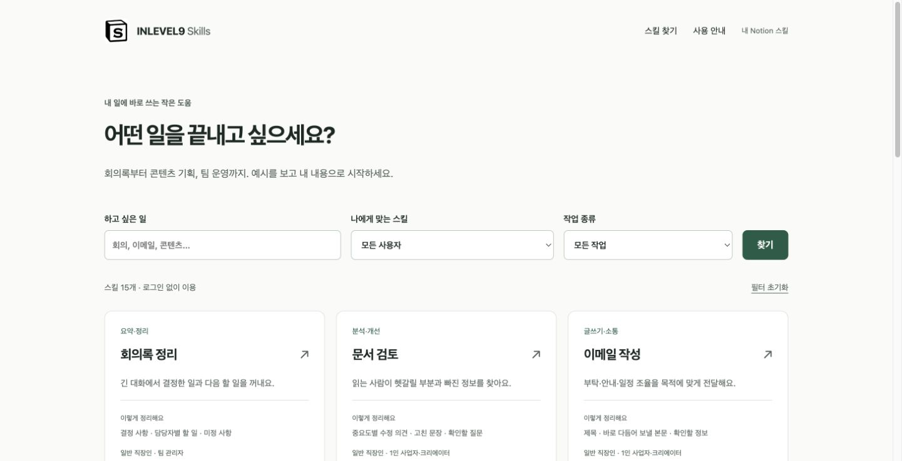
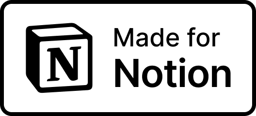
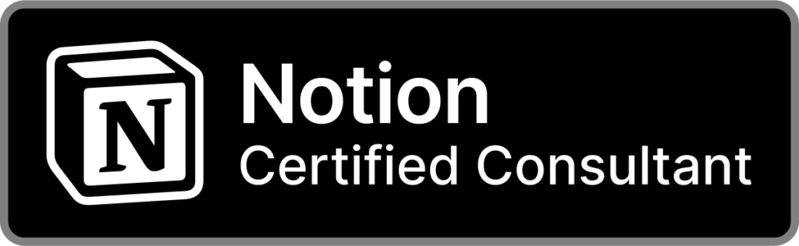

<p align="center">
  <a href="https://skills.inlevel9.com">
    
  </a>
</p>

<h1 align="center">INLEVEL9 Skills</h1>

<p align="center">
  <a href="https://skills.inlevel9.com/catalog"></a>
  <a href="https://skills.inlevel9.com"></a>
  <a href="package.json"></a>
  <a href="https://bun.sh"></a>
  <a href="LICENSE"></a>
  <a href="https://github.com/oswarld/notion-skills/stargazers"></a>
</p>

<p align="center">
  <strong>Notion을 더 잘 쓰는 방법을, 매일 쓰는 스킬로.</strong><br>
  글쓰기 규칙과 업무 경험을 재사용할 수 있는 지침으로 정리합니다.<br>
  더 명확한 문서와 일관된 업무를 위한 한국어 스킬 라이브러리입니다.
</p>

<p align="center">
  <a href="https://skills.inlevel9.com"><strong>서비스 바로 가기</strong></a> ·
  <a href="#why">만든 이유</a> ·
  <a href="#quick-start">빠른 시작</a> ·
  <a href="#skills">스킬 둘러보기</a> ·
  <a href="#development">직접 실행하기</a> ·
  <a href="#creator">만든 사람</a> ·
  <a href="https://github.com/oswarld/notion-skills/issues">의견 보내기</a>
</p>

---

<a id="why"></a>

## ✍️ 왜 만들었나요?

저는 Notion 초기부터 이 도구를 사용해 왔습니다. Notion 공식 컨설턴트이자 앰배서더로 활동하며, 여러 해 동안 문서를 쓰고 지식을 정리하는 데 Notion을 활용했습니다.

그 과정에서 글을 쓰기 전에 **어휘, 문장, 문서 구조의 규칙을 먼저 정하는 것**이 효과적이라는 사실을 경험했습니다. 직접 글을 쓸 때도, Notion AI에 작성을 요청할 때도 기준이 분명하면 결과가 더 일관되고 검토하기 쉬웠습니다.

Notion에서는 불릿과 블록 단위로 내용을 쌓아 갑니다. 한 항목에 한 가지 내용을 담고, 같은 개념에 같은 말을 쓰며, 문서의 목적에 맞게 구조를 정하는 방식이 잘 맞았습니다. 이렇게 정리한 내용은 나중에 다시 읽고, 고치고, 다른 문서에 활용하기도 수월했습니다.

**INLEVEL9 Skills는 이런 경험과 규칙을 반복해서 활용할 수 있는 스킬로 정리하는 프로젝트입니다.** 사용자가 글쓰기와 업무의 기준을 세우고, Notion을 더 효과적으로 사용하도록 돕는 것이 이 프로젝트를 만드는 이유입니다.

## 📐 Notion에 맞는 작성 규칙

[ASD-STE100](https://www.asd-ste100.org/STE_faq.html)은 영문 기술문서에 사용할 어휘와 작성 규칙을 정하는 표준입니다. **쉬운 어휘와 일관된 규칙으로 뜻을 분명하게 전달하는 접근**을 참고했습니다. 이를 Notion에서 활용하려면 페이지의 목적, 블록의 역할, 문서 사이의 연결, 다음에 할 일까지 구체적인 기준으로 정리할 수 있습니다.

예를 들어 회의 메모를 정리할 때는 결정 사항을 위에 두고, 해야 할 일은 담당자와 함께 구분하며, 긴 논의 기록은 토글 안에 둘 수 있습니다. 읽는 사람은 필요한 내용을 빠르게 찾고, 작성자는 같은 구조를 다음 회의에도 재사용할 수 있습니다.

| 기준 | 구체적인 규칙 예시 |
| --- | --- |
| 페이지 | 제목에서 주제와 목적을 드러내고, 맨 위에 핵심 내용 배치 |
| 블록 | 한 블록에 한 내용을 담고, 불릿·번호·체크박스를 역할에 맞게 사용 |
| 읽는 순서 | 결정 사항과 다음 행동을 먼저 보여 주고, 상세 배경은 아래나 토글에 배치 |
| 연결과 근거 | 기존 페이지·용어·속성 이름을 유지하고, 제공된 출처와 연결 |
| 후속 작업 | 결정·제안·미정 사항을 구분하고, 담당자·기한·완료 상태는 확인된 값만 사용 |

이 기준은 문서의 용도에 따라 달라집니다. 회의록에는 결정과 할 일이, 업무 안내에는 실행 순서와 완료 기준이 중요합니다. 이런 기준을 스킬로 정리하면 Notion AI에 요청하거나 직접 문서를 작성할 때 반복해서 활용할 수 있습니다.

<details>
<summary><strong>Notion 문서 작성 규칙 — 프롬프트 예시 보기</strong></summary>

Notion에서 문서를 작성하거나 정리할 때 사용할 수 있는 지침의 예시입니다. 기존 문서의 목적과 팀의 작성 방식에 맞게 조정해 사용하세요.

```text
[Notion 문서 작성 규칙]

목적: 읽고, 공유하고, 다음 행동으로 옮기기 쉬운 Notion 문서를 만든다.
적용 범위: 내가 요청한 페이지 작성, 문서 정리, 회의록과 자료 요약.

1. 페이지의 목적과 읽는 순서
- 제공된 내용에서 독자와 문서의 목적을 파악한다.
- 제목은 무엇에 관한 문서인지 드러나게 쓴다.
- 맨 위에 핵심 결론이나 현재 상태를 짧게 정리한다.
- 독자가 해야 할 행동이 있다면 요약 다음에 배치한다.
- 기존 페이지를 수정할 때는 요청한 범위와 기존 문서 구조를 존중한다.

2. 블록을 용도에 맞게 선택
- 한 블록에는 한 가지 내용을 담는다. 설명이 길어지면 소제목으로 나눈다.
- 동등한 항목은 불릿, 순서가 중요한 절차는 번호 목록으로 쓴다.
- 실제로 수행할 일만 체크박스로 만든다. 사실이나 설명에는 쓰지 않는다.
- 같은 항목끼리 비교할 때 표를 사용한다.
- 긴 참고 자료는 토글에 넣고, 핵심 결론과 할 일은 펼친 상태로 둔다.
- 콜아웃은 놓치면 안 되는 결정이나 주의 사항에만 사용한다.
- 목록이 깊게 중첩되면 소제목으로 나눈다.

3. 표현과 근거
- 쉬운 말과 짧은 문장을 사용한다. 한 문장에 여러 주장을 섞지 않는다.
- 같은 개념의 이름을 일관되게 쓰고, 기존 페이지·데이터베이스 속성명을 유지한다.
- 확정된 결정, 제안, 아직 정하지 않은 사항을 구분한다.
- 수치와 인용에는 제공된 출처를 연결한다. 출처가 없으면 그 한계를 적는다.
- 제공되거나 실제로 확인한 페이지 링크만 사용한다.
- 담당자, 기한, 완료 상태는 자료에 있는 값만 사용한다.
  필요한 값이 없으면 임의로 채우지 말고 미정으로 표시한다.

4. 문서 유형에 맞는 구성
- 회의록: 결정 사항 → 할 일과 담당자·기한 → 미정 사항 → 논의 기록.
- 프로젝트 현황: 목표 → 현재 상태 → 다음 할 일 → 막힌 점과 필요한 결정.
- 업무 안내: 목적과 사전 조건 → 실행 순서 → 완료 확인 방법 → 예외 상황.
- 자료 요약: 핵심 내용 → 근거와 출처 → 업무에 적용할 점 → 남은 질문.
- 문서에 필요하지 않은 항목은 만들지 않는다.

5. 작성 후 점검
- 제목과 요약만 읽어도 문서의 목적과 핵심 내용을 알 수 있는지 확인한다.
- 각 할 일이 실행 가능한 행동으로 쓰였는지 확인한다.
- 중복 설명을 줄이고, 확인된 사실과 작성자의 해석이 섞이지 않았는지 점검한다.
```

</details>

## ✨ 어떤 서비스인가요?

**현재는 기본 스킬 15개, Notion 스킬 연결, 팀 스킬 동기화를 제공합니다.**

스킬은 AI가 일을 처리할 때 참고하는 작업 지침입니다. 무엇을 입력해야 하는지, 어떤 순서로 살펴봐야 하는지, 결과를 어떤 형식으로 정리해야 하는지를 담고 있습니다.

INLEVEL9 Skills에서는 기본 스킬을 바로 사용하거나, Notion에서 관리하는 스킬을 연결해 내려받을 수 있습니다. 팀에서 사용한다면 명령줄 도구로 Notion의 스킬을 GitHub에 정기적으로 동기화할 수도 있습니다.

| 바로 써 보는 기본 스킬 | 내 Notion 스킬 연결 | 팀 스킬 자동 동기화 |
| --- | --- | --- |
| 업무에 맞는 한국어 스킬 15개 | Notion에서 허용한 스킬 묶음 조회 | Notion → GitHub 정기 동기화 |
| 예시 확인 → 내 내용 입력 → 요청 복사 | Notion 로그인 → 공유 대상 선택 → 다운로드 | 명령줄 도구와 GitHub Actions로 운영 |
| 로그인·설치 없이 시작 | 사용자용 API 토큰 발급 불필요 | 팀의 스킬을 한곳에서 관리·배포 |

<p align="center">
  <a href="https://skills.inlevel9.com/catalog">
    
  </a>
</p>

<a id="quick-start"></a>

## 🚀 빠르게 시작하기

> [!TIP]
> **처음이라면, 설치 없이 시작하세요.**
>
> [스킬 둘러보기](https://skills.inlevel9.com/catalog)에서 업무를 고르면 됩니다. 기본 스킬은 로그인이나 Notion 연결 없이 바로 사용할 수 있습니다.

1. **[스킬 목록](https://skills.inlevel9.com/catalog)에서 하고 싶은 일을 찾으세요.** 회의, 이메일, 콘텐츠처럼 익숙한 말로 검색할 수 있습니다.
2. **예시를 확인하고 내 내용을 입력하세요.** 스킬마다 필요한 자료와 결과 예시를 안내합니다.
3. **만들어진 요청을 복사해 사용 중인 AI 대화에 붙여넣으세요.** 스킬 파일을 지원하는 앱에서는 내려받은 파일을 활용할 수도 있습니다.

기본 스킬은 `SKILL.md`가 포함된 `.zip`으로 내려받습니다. 이 서비스는 작업 지침을 준비하며, 실제 AI의 답변 생성은 사용자가 선택한 AI 앱에서 이루어집니다.

<a id="skills"></a>

## 🧩 이런 일에 활용하세요

| 하고 싶은 일 | 제공하는 스킬 |
| --- | --- |
| 대화와 업무를 정리하고 싶을 때 | [회의록 정리](https://skills.inlevel9.com/catalog/meeting-notes), [이번 주 할 일 정리](https://skills.inlevel9.com/catalog/weekly-plan), [주간 업무 보고](https://skills.inlevel9.com/catalog/status-report) |
| 더 명확하게 쓰고 전달하고 싶을 때 | [문서 검토](https://skills.inlevel9.com/catalog/document-review), [이메일 작성](https://skills.inlevel9.com/catalog/email-draft), [고객 문의 답변](https://skills.inlevel9.com/catalog/customer-reply) |
| 콘텐츠와 캠페인을 준비할 때 | [콘텐츠 일정 만들기](https://skills.inlevel9.com/catalog/content-calendar), [콘텐츠 재구성](https://skills.inlevel9.com/catalog/content-repurpose), [캠페인 기획서](https://skills.inlevel9.com/catalog/campaign-brief) |
| 자료를 비교하고 판단할 때 | [자료 요약·비교](https://skills.inlevel9.com/catalog/research-summary), [고객 의견 묶어 보기](https://skills.inlevel9.com/catalog/customer-feedback), [선택지 비교·결정 메모](https://skills.inlevel9.com/catalog/decision-brief) |
| 팀의 일을 설계할 때 | [프로젝트 실행 계획](https://skills.inlevel9.com/catalog/project-plan), [업무 매뉴얼 만들기](https://skills.inlevel9.com/catalog/sop-guide), [새 팀원 온보딩](https://skills.inlevel9.com/catalog/onboarding-plan) |

## 🔗 내 Notion 스킬 연결하기

[내 Notion 스킬](https://skills.inlevel9.com/skills)에서 로그인한 뒤, 연결에 공유할 스킬 데이터베이스를 선택하세요. 연결이 읽을 수 있는 스킬 묶음만 목록에 표시됩니다. 일반 사용자는 GitHub 계정이나 별도의 API 토큰을 준비할 필요가 없습니다.

- **읽기 권한으로 연결합니다.** 웹 서비스가 Notion의 내용을 수정하거나 새 데이터베이스를 만들지는 않습니다.
- **원본 파일을 내려받습니다.** Notion이 제공하는 `.tar.gz` 압축 파일에는 `SKILL.md`와 첨부 파일이 포함됩니다. AI 앱에 자동으로 설치되지는 않습니다.
- **공유 범위가 조회 범위입니다.** 일반 데이터베이스가 아닌 Notion 스킬 데이터베이스를 사용하고, 연결에 해당 데이터베이스의 접근 권한을 부여해야 합니다.
- **로그아웃과 연결 해제는 다릅니다.** 로그아웃은 이 브라우저의 세션을 지우고, 연결 해제는 Notion 접근 토큰을 취소합니다.

> [!NOTE]
> **내가 입력한 내용은 어떻게 처리하나요?**
>
> 기본 스킬 화면에 입력한 업무 내용은 브라우저 안에서 요청을 만드는 데 사용하며 서버로 전송하거나 저장하지 않습니다. 검색어는 주소에 포함되므로 브라우저 기록이나 호스팅 로그에 남을 수 있습니다.

<a id="development"></a>

## 💻 직접 실행하기

[Bun](https://bun.sh/)을 준비한 뒤 저장소를 복제하고 실행하세요.

```bash
git clone https://github.com/oswarld/notion-skills.git
cd notion-skills
bun install
bun run dev
```

[로컬 스킬 목록](http://localhost:3000/catalog)을 열면 기본 스킬을 사용할 수 있습니다. Notion 로그인 기능을 사용하려면 아래의 OAuth 설정이 추가로 필요합니다.

<details>
<summary><strong>웹 서비스 연결 설정과 배포 안내</strong></summary>

### 환경변수 설정

설정은 모두 환경변수로 관리합니다. 로컬에서는 `.env`에, 운영 환경에서는 호스팅 서비스의 환경변수 설정에 입력하세요. 연결 정보나 비밀값을 저장소에 커밋하지 마세요.

| 환경변수 | 용도 |
| --- | --- |
| `WEB_BASE_URL` | 서비스의 기본 주소. 로컬은 `http://localhost:3000`, 운영은 직접 배포할 도메인 |
| `NOTION_OAUTH_CLIENT_ID` | Notion 공개 연결의 클라이언트 식별자 |
| `NOTION_OAUTH_CLIENT_SECRET` | Notion 공개 연결의 클라이언트 비밀값 |
| `WEB_SESSION_KEY` | 세션 암호화에 사용할 32바이트 난수의 64자리 16진수 표현 |

세션 키는 다음 명령으로 생성할 수 있습니다.

```bash
openssl rand -hex 32
```

[Notion 연결 관리](https://app.notion.com/developers/connections)에서 공개 OAuth 연결을 만들고 콘텐츠 읽기 권한만 설정하세요. 리디렉션 주소는 서비스 기본 주소에 `/auth/notion/callback`을 붙인 값입니다. 로컬 로그인을 시험하려면 `http://localhost:3000/auth/notion/callback`도 등록해야 합니다.

### Vercel 배포

이 프로젝트는 TypeScript 요청 처리기와 서버에서 렌더링한 HTML, 정적 파일로 구성됩니다. [배포 설정](vercel.json)은 프레임워크를 `Other`로 지정하고, 요청을 [진입점](api/index.ts)으로 전달합니다.

운영 환경변수를 설정한 뒤 배포하세요. 운영 도메인과 `WEB_BASE_URL`은 정확히 일치해야 합니다. `/health`의 정상 응답은 설정이 준비되었다는 뜻이며, 실제 연결 확인은 Notion 로그인·목록 조회·다운로드로 진행합니다.

자세한 내용은 [웹 서비스 운영 문서](web/README.md)와 [환경변수 예시](.env.example)를 참고하세요.

</details>

## 🔄 팀 스킬을 GitHub에 동기화하기

Notion을 팀 스킬의 원본으로 사용하고, GitHub 저장소를 플러그인 배포 공간으로 사용할 수 있습니다. 팀원은 Notion에서 지침을 관리하고, 호환되는 AI 앱은 GitHub에 배포된 스킬을 사용합니다.

```text
Notion 스킬 데이터베이스 → 동기화 도구 → GitHub 플러그인 저장소 → AI 앱
```

웹 서비스의 로그인·다운로드 기능과는 별도로 설정합니다. [예약 실행 작업](.github/workflows/sync.yml)은 매시간 실행하도록 구성되어 있으며, GitHub Actions에서 수동으로 실행할 수도 있습니다.

<details>
<summary><strong>처음 설정하기와 동기화 명령 보기</strong></summary>

### 처음 설정하기

```bash
bun run setup
```

안내형 설정 도구는 다음 과정을 진행합니다.

1. Notion 명령줄 도구 `ntn`과 GitHub 명령줄 도구 `gh`의 인증 상태를 확인합니다.
2. 샘플 스킬이 포함된 Notion 스킬 데이터베이스와 동기화에 사용할 GitHub 저장소를 준비합니다.
3. 전용 Notion 연결과 GitHub 접근 토큰 설정을 안내합니다.
4. GitHub Actions를 구성하고 실제 동기화를 확인합니다.
5. 팀이 사용하는 AI 앱에서 GitHub 플러그인 저장소를 연결하는 방법을 안내합니다.

설정 도구는 외부 리소스를 생성하고 동기화를 실행합니다. 사전에 Notion과 GitHub의 필요한 권한을 준비하세요. 직접 환경변수를 설정하려면 [설정 지침](AGENTS.md)과 [환경변수 예시](.env.example)를 참고할 수 있습니다.

### 직접 설정할 때 필요한 값

| 환경변수 | 용도 |
| --- | --- |
| `NOTION_API_TOKEN` | 배포할 스킬을 읽을 수 있는 Notion 토큰 |
| `GITHUB_REPO` | 스킬을 배포할 대상 저장소의 `소유자/저장소` 값 |
| `GITHUB_TOKEN` | 대상 저장소에 쓸 수 있는 GitHub 토큰. 로컬에서는 `gh` 인증 토큰으로 대체 가능 |
| `GITHUB_BRANCH` | 대상 브랜치. 기본값은 `main` |
| `NOTION_ENV` | Notion 환경. 기본값은 `prod` |
| `SKILLS_DATA_SOURCE_ID` | 스킬 원본을 가리키는 데이터 소스 식별자. 조회에는 필요하지 않은 선택값 |

GitHub Actions에서는 토큰을 비밀값 `NOTION_API_TOKEN`, `GH_PUSH_TOKEN`으로 등록합니다. 저장소와 브랜치는 변수 `SKILLS_GITHUB_REPO`, `SKILLS_GITHUB_BRANCH`로 등록하며, 실행 시 위 환경변수 이름으로 연결됩니다.

### 자주 쓰는 명령

| 목적 | 명령 |
| --- | --- |
| 대상 저장소를 변경하지 않고 결과 확인 | `bun run dry-run` |
| 대상 저장소에 실제 동기화 | `bun run sync` |
| 원본 저장소의 도구 업데이트 가져오기 | `bun run update` |

전체 목록을 정상적으로 조회한 뒤에는 Notion에서 더 이상 보이지 않는 플러그인이 대상 저장소에서도 제거됩니다. 공유 권한을 바꾸기 전후에 `bun run dry-run`으로 결과를 확인하세요.

</details>

<details>
<summary><strong>Notion 스킬 API의 묶음·조회·파일 처리 방식</strong></summary>

- 웹 서비스와 명령줄 도구는 `Notion-Version: 2026-03-11`을 사용합니다. 콘텐츠 읽기 권한과 해당 스킬 데이터베이스에 대한 접근 권한이 필요합니다.
- 스킬의 태그 값마다 하나의 플러그인 묶음이 만들어집니다. 태그가 없는 스킬은 단독 묶음이 됩니다. 행별 게시 체크박스는 사용하지 않습니다.
- 플러그인 목록을 한 페이지에 최대 100개씩 조회하고, 마지막 페이지까지 확인합니다. 요청 실패, 잘못된 응답, 반복 커서, 중복 식별자가 있으면 대상 변경 전에 중단합니다.
- 플러그인 압축 파일에는 최대 100개 스킬이 포함됩니다. 초과하면 최근 수정된 스킬부터 포함되므로, 모두 배포하려면 태그별 묶음을 나누세요. 이 제한은 목록의 페이지당 개수와 별개입니다.
- 명령줄 도구는 `version_id`가 같으면 기존 파일을 재사용합니다. 변경된 묶음은 임시 다운로드 주소에서 받아 원본 파일 구조를 유지하고, 단일 ZIP 첨부 파일을 풀어 동기화 표시와 Claude 호환 메타데이터를 추가합니다.
- 압축 파일 저장소에는 Notion 토큰을 전달하지 않습니다. 웹 서비스는 Notion 원본 압축 파일을 직접 내려받도록 연결합니다.
- 이 프로젝트는 플러그인 묶음 단위로 처리하며, 개별 스킬 조회 API는 동기화에 사용하지 않습니다.

공식 문서: [스킬 API 개요](https://developers.notion.com/guides/agent-skills/overview) · [플러그인 목록 조회](https://developers.notion.com/reference/agent-skills/list-skills-plugins) · [플러그인 파일 조회](https://developers.notion.com/reference/agent-skills/get-plugin-directory)

</details>

## 🛠️ 개발 및 기여

기능을 수정한 뒤에는 타입 검사와 테스트를 실행하세요.

```bash
bun run typecheck
bun test
```

| 위치 | 담고 있는 내용 |
| --- | --- |
| [`skills/`](skills/) | 기본 스킬 15개의 작업 지침 |
| [`web/`](web/) | 화면, 스킬 목록, OAuth 연결과 세션 처리 |
| [`public/`](public/) | 스타일, 로고, 브라우저에서 실행하는 코드 |
| [`api/`](api/) | Vercel 요청 진입점 |
| [`src/`](src/) | Notion 조회와 GitHub 동기화 도구 |
| [`setup/`](setup/) | 안내형 초기 설정 도구 |
| [`test/`](test/) | 동작 검증과 회귀 테스트 |

새로운 스킬 제안이나 개선 의견은 [이슈](https://github.com/oswarld/notion-skills/issues)에 남겨 주세요. 기본 스킬의 구성 배경은 [스킬 조사 및 출시 계획](docs/catalog-research.md)에서 볼 수 있습니다.

## ❓ 자주 묻는 질문

**코딩을 몰라도 사용할 수 있나요?**

네. [운영 중인 서비스](https://skills.inlevel9.com)를 열어 스킬을 고르면 됩니다. 직접 설치하거나 이 저장소를 복제할 필요가 없습니다.

**AI 구독이나 별도 계정이 필요한가요?**

기본 스킬을 둘러보고 요청을 만드는 데 서비스 로그인은 필요하지 않습니다. 복사한 요청을 실행할 AI 앱의 계정과 이용 조건은 해당 앱을 따릅니다. 내 Notion 스킬을 가져올 때만 Notion 로그인이 필요합니다.

**다운로드하면 AI 앱에 바로 설치되나요?**

파일을 내려받는 단계까지 제공합니다. 설치 방법과 지원하는 압축 형식은 AI 앱마다 다르므로 [사용 안내](https://skills.inlevel9.com/guide)를 확인하세요.

**Notion에 있는 스킬이 목록에 없어요.**

해당 데이터베이스가 Notion 스킬 데이터베이스인지, 연결에 콘텐츠 읽기 권한과 데이터베이스 접근 권한이 있는지 확인하세요. 접근을 허용하지 않은 스킬은 표시되지 않습니다.

**이미 GitHub에서 팀 스킬을 관리하고 있다면요?**

Notion에서 편집할 스킬을 위한 별도 배포 저장소를 두는 방식으로 시작할 수 있습니다. 기존 저장소와 용도를 나누면 개발자와 비개발자가 각자 익숙한 도구에서 지침을 관리하기 쉽습니다.

<a id="creator"></a>

## 👋 만든 사람

**안광섭(오스왈드)** · INLEVEL9 전략 컨설턴트 · 세종대학교 겸임교수

Notion 초기 사용자이자 공식 컨설턴트·앰배서더입니다. Notion의 한국 론칭과 커뮤니티를 거쳐, 기업의 AI 도입과 제품·시장 전략을 돕고 있습니다. 여러 해 쌓은 Notion 활용 경험과 문서 작성 기준을 이 프로젝트에 담고 있습니다.

<p>
  <a href="https://inlevel9.com/about"></a>
  <a href="https://www.linkedin.com/in/oswarld/"></a>
</p>

자세한 이력과 활동은 [INLEVEL9 소개](https://inlevel9.com/about)와 [LinkedIn 프로필](https://www.linkedin.com/in/oswarld/)에서 확인할 수 있습니다.

<p>
  
  &nbsp;
  
</p>

## 📄 라이선스

이 프로젝트는 Notion의 [스킬 동기화 예제](https://github.com/makenotion/notion-skills-github-sync)를 바탕으로 한국어 웹 서비스와 기본 스킬 라이브러리를 확장했습니다. 원본의 저작권 고지와 [MIT 라이선스](LICENSE)를 유지합니다.
